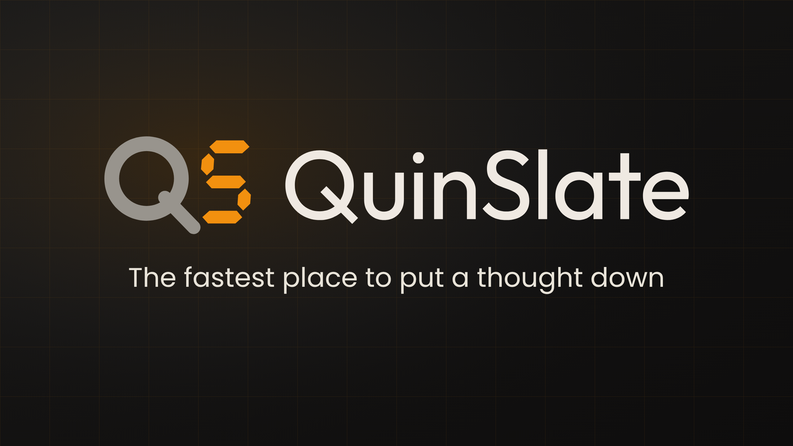

# QuinSlate



A lightweight, always-at-hand scratchpad for Windows. QuinSlate lives in the
system tray and gives you five persistent text slates you can summon with a
global hotkey. Jot notes, stash clipboard snippets, do quick inline math, and
have it all autosaved to plain text.

<a href="https://apps.microsoft.com/detail/9PF611LPJMJJ?referrer=appbadge&mode=full" target="_blank" rel="noopener noreferrer">
  
</a>

## Features

- **5 persistent slates** - as colour-coded tabs, autosaved to plain `.txt` files.
- **Global hotkey** - (Ctrl+Shift+Q) to toggle the panel from anywhere.
- **System tray icon** - with left-click toggle and context menu.
- **Peek panel** - glance at a buffer without stealing focus.
- **Inline calc** - type an expression, get the result.
- **Pin on top** - single-instance, and launch-on-login support.

## Stack

WinUI 3 on .NET 10. Tray icon, global hotkeys, and always-on-top are Win32 via
P/Invoke. State persists as plain text in `%AppData%\QuinSlate\`. MSIX-packaged.

## Build

```bash
dotnet build QuinSlate.slnx
dotnet test QuinSlate.slnx
```
